# rest-api

REST API to access data on Oracle DB. I develop this project using Python and Flask frameworks.

**Testing the REST API :**
- 	Sample search by Name & Nik
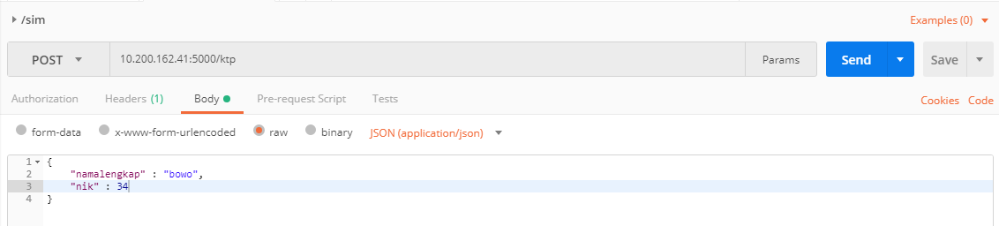
Result :
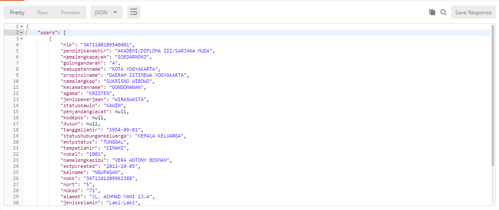

- 	Sample search by namalengkapayah, golongandarah, and namalengkap
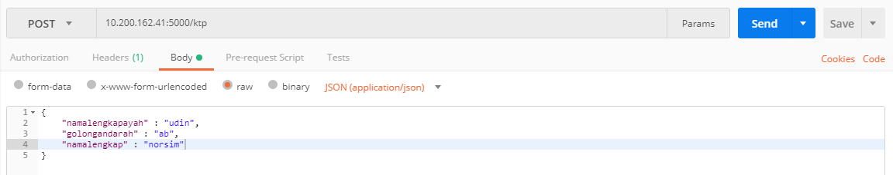
Result :
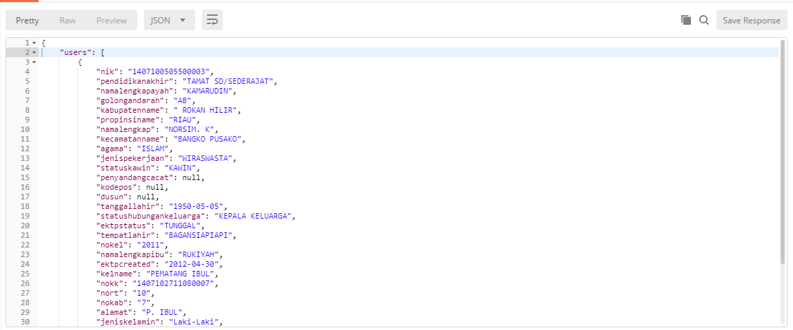

- 	Sample search by NIK, propinsiname, kecamatanname, and alamat
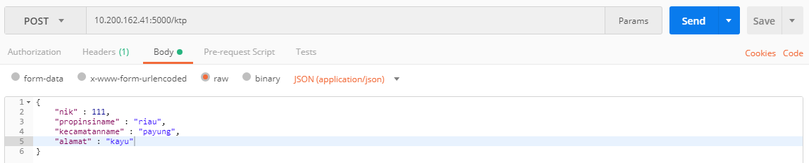
Result :
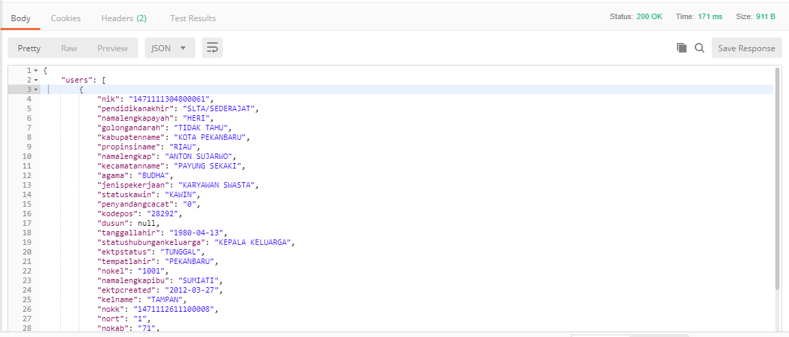

- 	Sample search by NIK, propinsiname, kecamatanname, and alamat

Result :

**Stress Test :**
- Testing API with 100 requests and 1 keywords
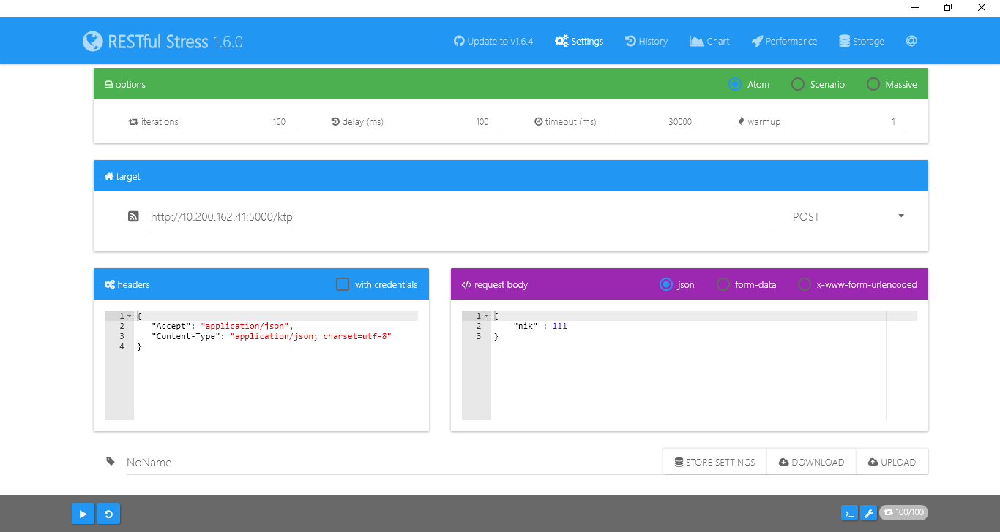
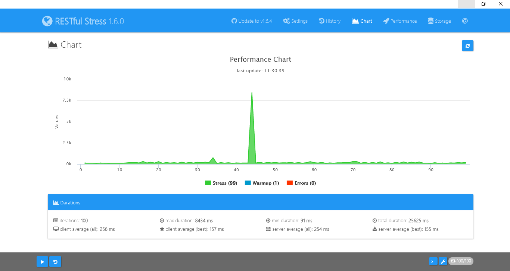
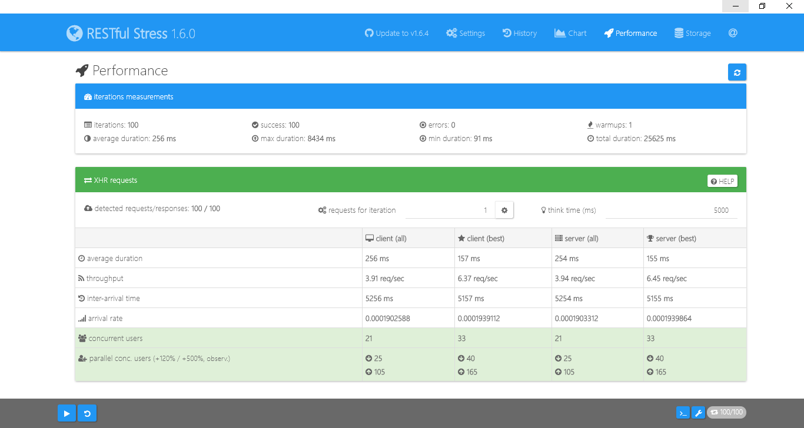

- Testing API with 100 requests and 2 keywords

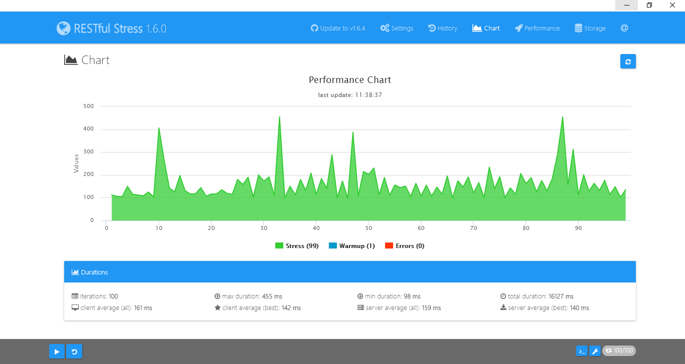

- Testing API with 100 requests and 3 keywords
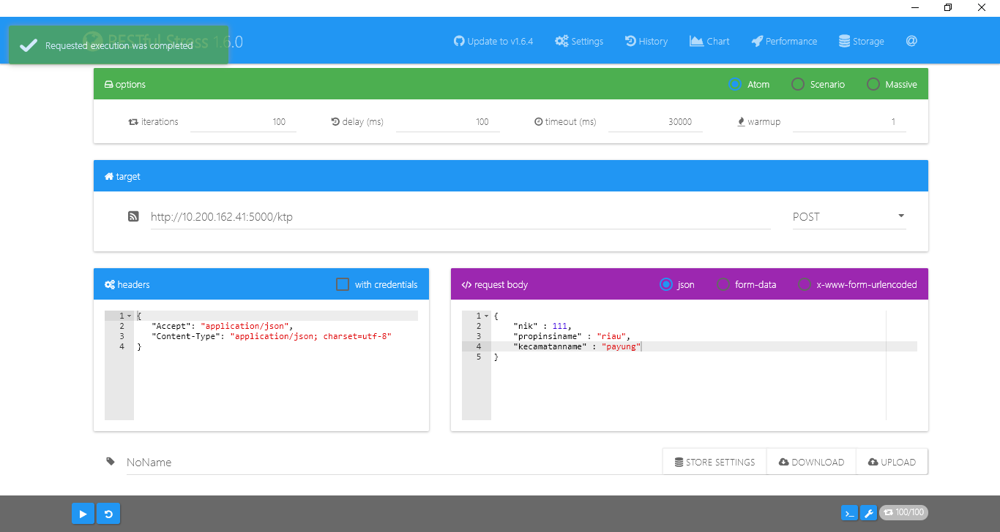

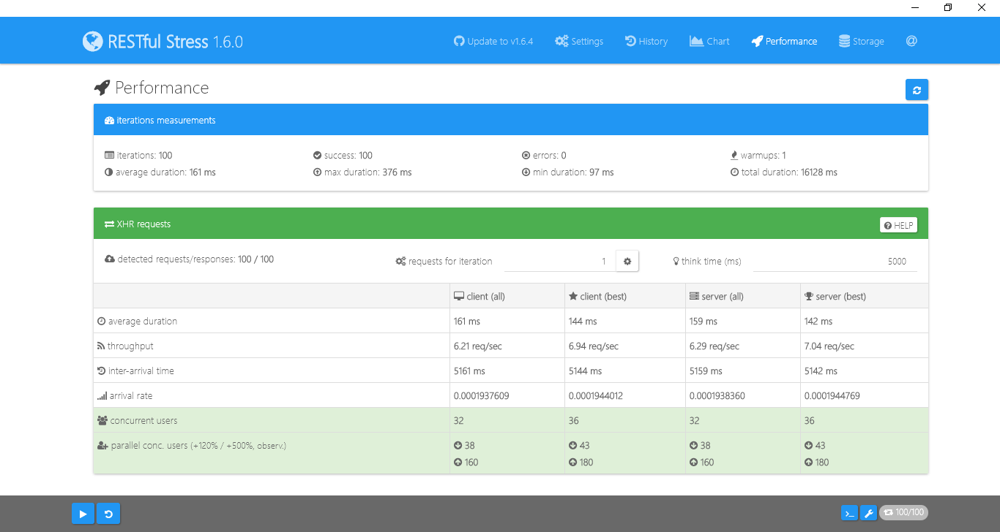

- Testing API with 1000 requests and 1 keywords
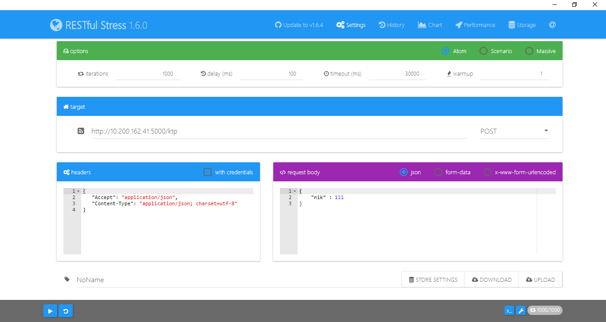
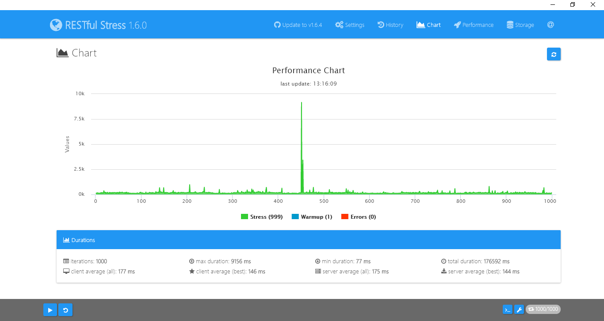
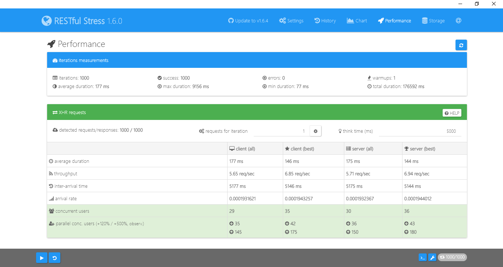

- Testing API with 1000 requests and 2 keywords
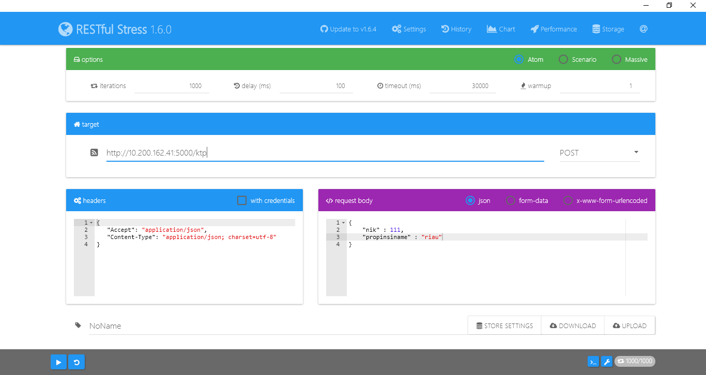
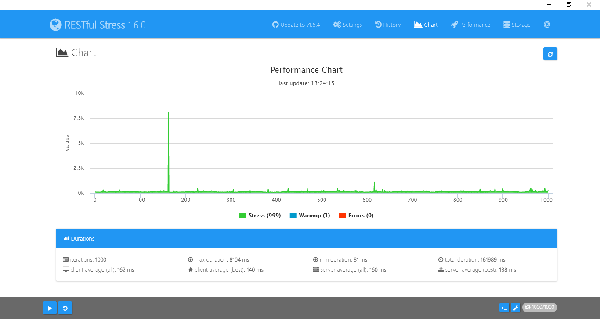

- Testing API with 1000 requests and 3 keywords
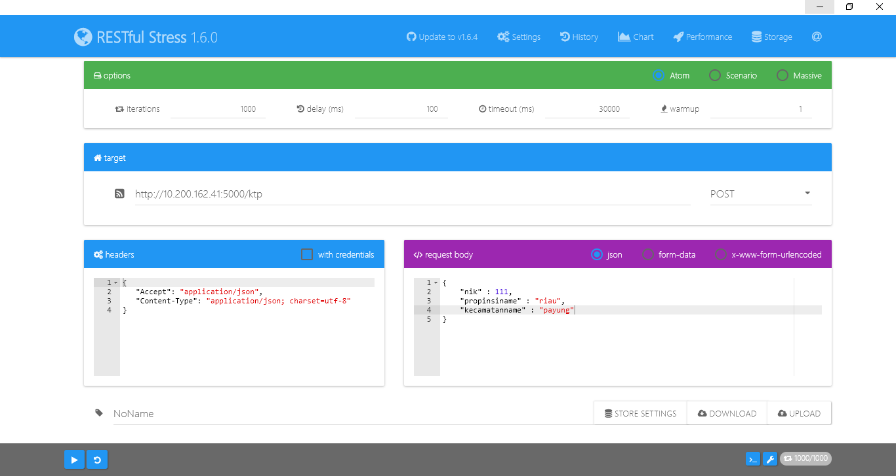
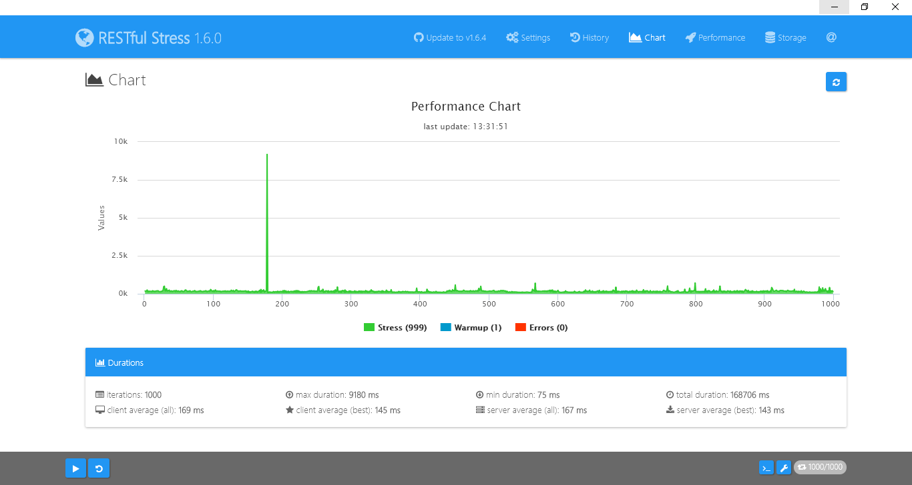
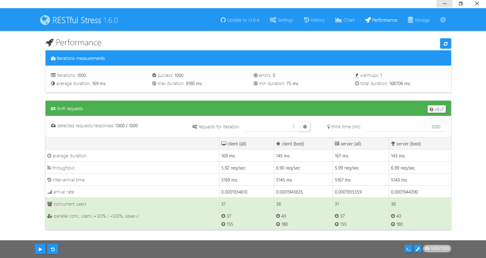
